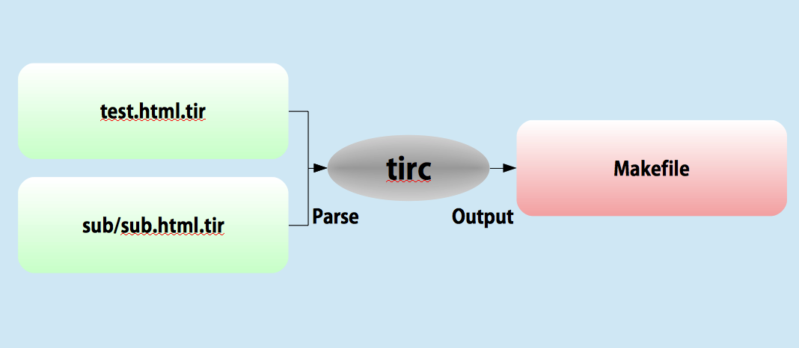

事例
===
[目次に戻る](contents_jp.md)

##2. 複数ファイル＆ネスティング（入れ子）




Command:
```
$ tirc ./example2
$ make -f ./example2/Makefile
```
or
```
$ make ex2
```
Makefile
```
all: ./example2/sub/sub.html ./example2/test.html

# Makefile info:
./example2/sub/sub.html: ./example2/sub/sub.html.tir ./example2/sub/hey.html
	tir './example2/sub/sub.html.tir' -o './example2/sub/sub.html' -bw '<!--[tir:begin]' -ew '[tir:end]-->' -y -cfg ./example2/tir.cfg

# Makefile info:
./example2/test.html: ./example2/test.html.tir ./example2/test_sub.html ./example2/sub/sub.html
	tir './example2/test.html.tir' -o './example2/test.html' -bw '<!--[tir:begin]' -ew '[tir:end]-->' -y -cfg ./example2/tir.cfg
```

test.html.tir:
```
<!DOCTYPE html>
<html>
	<head>
		<!--[tir:begin] ref="test_sub.html" convert="urlpaese" [tir:end]-->
	</head>
	<body>
		<!--[tir:begin]  ref="./sub/sub.html" [tir:end]-->
	</body>
</html>
```

test_sub.html:
```
<h1>Hello!!</h1>
```
sub/sub.html.tir
```
<!--[tir:begin] ref="hey.html" [tir:end]-->
```
sub/hey.html
```
<h1>Hey!</h1>
```
result(test.html)
```
<!DOCTYPE html>
<html>
	<head>
		<h1>Hello!!</h1>

	</head>
	<body>
		<h1>Hey!</h1>
	</body>
</html>
```

説明:
 * 'tirc'は指定されたディレクトリに'tir'ファイルのためのMakefileを作りあげた。
 * HTMLタグ'&lt;h1&gt;Hey!&lt;/h1&gt;'は、ネスティング（入れ子）構造の記述を実現した。

[目次に戻る](contents_jp.md)
